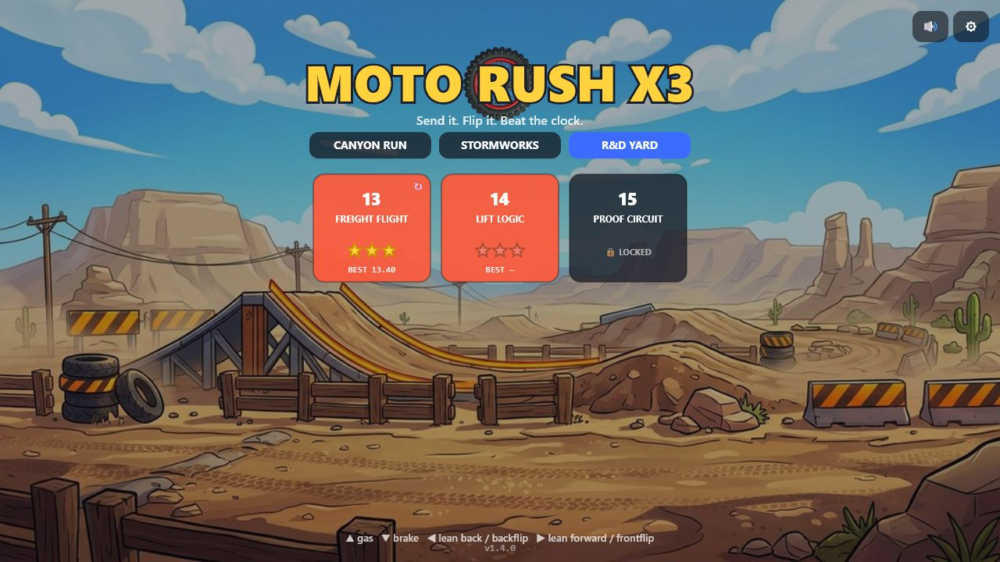
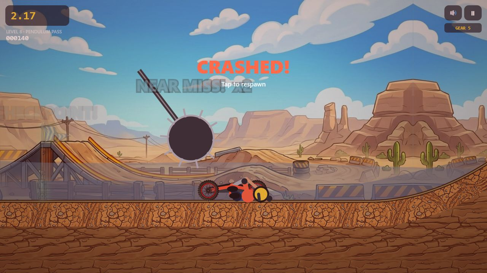

<p align="center">
  
</p>

<h1 align="center">MOTO RUSH X3</h1>

<p align="center"><strong>Send it. Land it. Prove it.</strong></p>

<p align="center">
  An original, momentum-driven 2D stunt racer about learning wild trails,
  riding moving machinery, and turning one more restart into a cleaner run.
</p>

<p align="center">
  <a href="https://qemmhd.github.io/motogame/"><strong>PLAY THE CURRENT LIVE BUILD</strong></a>
  &nbsp;&middot;&nbsp;
  <a href="ROADMAP.md">30-update roadmap</a>
  &nbsp;&middot;&nbsp;
  <a href="CHANGELOG.md">Release history</a>
  &nbsp;&middot;&nbsp;
  <a href="docs/PROJECT_STATE.md">Developer pickup</a>
</p>

<p align="center">
  
  
  
  
</p>

---

## The ride

Moto Rush X3 is a browser-first motorcycle physics game. Balance a physical bike across hand-built terrain, preserve momentum through graded landings, find faster stunt lines, and learn when the machinery itself is the best route.

The **v1.4.0 Proof & Platforms** wave grows the release candidate to 15 courses and adds the first R&D Yard trials. It also connects deterministic checkpoint restoration, last-run proof replays, solid moving platforms, crash ragdolls, landing grades, five-speed engine feedback, and a larger automated release gate.

## v1.4 gallery

| R&D Yard course menu | Freight platform route |
|:---:|:---:|
|  |  |

| Crash theater | Verified last-run replay |
|:---:|:---:|
|  |  |

<p align="center">
  
</p>

## Current game

- **15 handcrafted courses** across Canyon Run, Stormworks, and the new R&D Yard.
- **Physical motorcycle simulation** with wheel contacts, suspension response, lean control, flips, landing grades, momentum retention, crashes, checkpoints, and timed finishes.
- **Machine playgrounds** with patrol saws, pendulums, crushers, Nitro crates, freight shuttles, vertical lifts, ice, boost rails, and bouncy membranes.
- **Solid kinematic decks** that move on deterministic 60 Hz paths, carry the bike, catch fast crossings, and pass bounded velocity to a launch.
- **Proof of the last finish** through compact fixed-tick input tapes, deterministic state hashes, and build/physics/course compatibility checks.
- **Crash theater** with a separate segmented bike-and-rider ragdoll and a static reduced-motion presentation.
- **Reactive sound and HUD feedback** with five engine gears, load-sensitive pitch, landing audio, score callouts, and proof status.
- **Desktop and mobile controls** through keyboard and Pointer Events, including simultaneous touch, cancellation cleanup, pause handling, haptics, and reduced motion.
- **Installable offline PWA** with a complete, versioned service-worker precache and test-gated Pages publishing.
- **Local progression** for unlocks, stars, best times, best scores, settings, and one completed replay tape per level.

## What is new in v1.4

### R&D Yard: levels 13-15

**Freight Flight**, **Lift Logic**, and **Proof Circuit** introduce moving-ground routes above recoverable service roads. Their rails and lifts combine existing surfaces and machines without replacing the original 12-course campaign.

### Deterministic retry and replay proof

Full restarts rebuild authored initial state. Checkpoint retries restore a captured run snapshot, including the machine tick and hazard runtime state, then reset moving platforms to the same tick. A successful normal run stores compact gas, brake, lean, and fixed-tick crash-respawn input. Replay checks the finish tick and a canonical final-state hash against matching schema, level, build, physics, and course versions.

### Platforms you can actually ride

The new kinematic system uses solid, one-way rectangular tops rather than decorative hazard radii. It supports deterministic authored paths, interpolation for drawing, high-speed swept landings, stable wheel carry, bounded surface velocity, and bounded launch inheritance.

### Bike-and-rider physicality

Perfect, clean, rough, and slam landings now communicate how much momentum the bike keeps. The engine shifts through five visible bands and changes pitch with road speed, throttle, airborne revs, and load. Crashes hand the camera to a finite, terrain-aware ragdoll; reduced motion switches to a readable static pose and removes the strongest camera effects.

### Larger release evidence

The current gate contains **3 asset/offline subtests**, **28 deterministic system subtests**, and a **15-level headless physics/rules route gate**. These checks prove important invariants; they do not replace final keyboard, touch, audio, install, service-worker, and human difficulty QA.

See the exact release record in [CHANGELOG.md](CHANGELOG.md).

## Release-candidate honesty

`v1.4.0` describes the current repository worktree. It is not claimed as the production build until the reviewed change reaches an eligible publish branch, the Pages workflow succeeds, and the canonical URL is smoke-tested.

The current replay is a last-run proof, not yet a personal-best ghost, daily event, or share link. R&D Yard has three focused trials rather than a full six-level art pack. Platforms are solid axis-aligned decks, not arbitrary moving terrain. Star targets and alternate routes still require broader human keyboard and touch calibration.

## Controls

| Action | Keyboard | Touch / pointer |
|---|---|---|
| Accelerate | Up arrow or `W` | Gas button |
| Brake / reverse | Down arrow or `S` | Brake button |
| Lean back | Left arrow or `A` | Left rotate button |
| Lean forward | Right arrow or `D` | Right rotate button |
| Pause | `Esc` or `P` | Pause button |
| Restart level | `R` | Retry button / paused menu |
| Retry checkpoint after a crash | Space, Enter, or primary action | Tap the crash overlay |
| Replay completed run | Results screen | Replay button |

## Run locally

The shipped game has no compilation step. Serve `public/` through a static HTTP server:

```powershell
python -m http.server 8080 --directory public
```

Then open `http://127.0.0.1:8080/`.

Run the complete release gate:

```powershell
npm test
```

Focused suites are also available:

```powershell
npm run test:assets
npm run test:systems
npm run test:physics
```

Useful developer routes:

- `?dev&level=13` launches Freight Flight directly without registering the service worker.
- `?dev&level=15&autoplay` launches Proof Circuit with development test input.
- `?touch` forces touch controls for layout inspection.

## Project reference

| Document | Purpose |
|---|---|
| [ROADMAP.md](ROADMAP.md) | Thirty numbered updates, dependencies, current evidence, and remaining acceptance gates |
| [CHANGELOG.md](CHANGELOG.md) | Permanent release-by-release record of completed work |
| [docs/PROJECT_STATE.md](docs/PROJECT_STATE.md) | Exact worktree handoff, gaps, checks, and next priorities |
| [docs/ARCHITECTURE.md](docs/ARCHITECTURE.md) | Runtime modules, deterministic flow, invariants, and extension guides |
| [design/FEEL_SPEC.md](design/FEEL_SPEC.md) | Bike-feel targets and tuning reference |
| [design/assets.csv](design/assets.csv) | Art inventory and production tracking |

## Repository layout

```text
public/       Shipped Canvas game, PWA shell, simulation modules, levels, and assets
tools/        Deterministic system, physics, replay, and release verification
docs/         Store imagery, architecture, and current developer handoff
design/       Feel specification and art inventory
.github/      Test-gated GitHub Pages workflow and contribution checklists
```

## Project information

| | |
|---|---|
| **Current candidate** | v1.4.0 - Proof & Platforms |
| **Course count** | 15 across three menu worlds |
| **Format** | Static HTML, CSS, Canvas 2D, and native JavaScript modules |
| **Distribution** | GitHub Pages / installable PWA |
| **Canonical game** | <https://qemmhd.github.io/motogame/> |
| **Persistence** | Browser `localStorage`; no account or backend required |
| **Target** | Desktop and mobile browsers |

## Originality promise

Moto Rush X3 takes inspiration from the broad side-scrolling motorcycle stunt genre, but its code, systems, names, level layouts, tuning, visuals, and roadmap are built from first principles for this project. The project does not decompile competitors or copy proprietary source code, art, audio, UI layouts, exact tracks, or timing data.

## Credits

Created and directed by [QemmHD](https://github.com/QemmHD). Ongoing engineering and production work is recorded in this repository so every future update can resume from an accurate, reviewable state.
