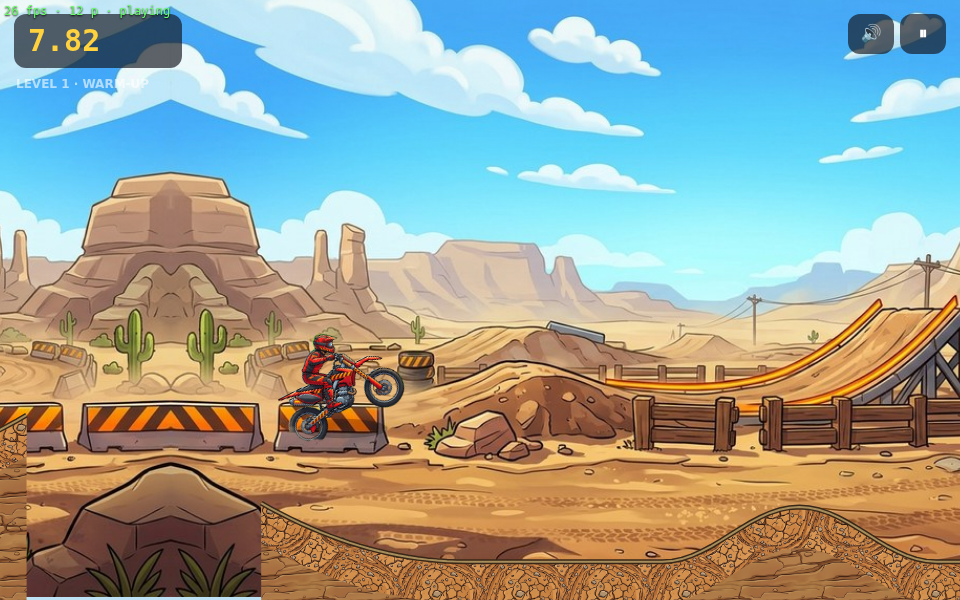

# 🏍️ Moto Rush X3

A physics-based motocross stunt racer in the browser — a **Moto X3M**-style time-attack.
Gas, brake and lean to fly through four desert obstacle courses, land backflips to
shave seconds off the clock, and dodge spinning saws, spikes and exploding barrels.

**▶ Play it live:** https://warm-aspen-246.higgsfield.gg/

**▶ Play from this GitHub repo (no setup):** https://raw.githack.com/QemmHD/motogame/gh-pages/index.html

**▶ GitHub Pages** (permanent `https://qemmhd.github.io/motogame/`): the `gh-pages`
branch (game files at root) is already pushed. Enable it once — repo **Settings →
Pages → Build and deployment → Source: "Deploy from a branch" → Branch: `gh-pages` /
`(root)` → Save**. The `.github/workflows/pages.yml` "GitHub Actions" source works too
once Pages is enabled.




## Play

| Action | Keyboard | Touch | Gamepad |
| --- | --- | --- | --- |
| Gas | ▲ / **W** | GAS button (right) | RT / A |
| Brake / reverse | ▼ / **S** | BRAKE button (right) | LT / B |
| Lean back (backflip) | ◀ / **A** | ↺ button (left) | D-pad ◀ / stick |
| Lean forward (frontflip) | ▶ / **D** | ↻ button (left) | D-pad ▶ / stick |

- **Every completed flip subtracts 0.5s** from your time — chain them on big jumps.
- **Crashing** (landing on your head / hitting a hazard) respawns you at the last
  checkpoint, and **the clock keeps running** — a blown flip is a net loss.
- Beat each level fast enough to earn **1–3 stars**; times are saved locally.
- `?dev=1` shows an FPS / state overlay.

## Levels

1. **Warm-Up** — gas, small jumps, clean landings.
2. **Air Time** — big kickers and gaps to flip over, spike pits.
3. **Danger Zone** — exploding barrels, overhead sawblades, whoops.
4. **Grand Finale** — everything, longer, tighter.

## How it's built

- **No engine, no dependencies.** Pure `<canvas>` 2D + ES modules, fixed-timestep
  (60 Hz) deterministic simulation, responsive canvas, touch/keyboard/gamepad input,
  and synthesized WebAudio (engine pitch tracks speed, plus land/crash/flip/finish SFX).
- **Custom bike physics** (`public/physics.js`): the bike is a 3-point Verlet triangle
  (rear wheel, front wheel, rider head). On the ground it runs as a soft body so the
  wheels conform to the terrain; in the air it switches to a crisp rigid body for tight
  flip control, with velocities carried across both modes. Terrain is polyline
  circle-vs-segment collision with an x-bucket broadphase.
- **All art generated with [Higgsfield](https://higgsfield.ai)** (`nano_banana_2`) under a
  single locked style formula, then post-processed: tiling ground textures run through a
  Moisan FFT seam-fix pipeline, sprites chroma-keyed to transparency, the bike cut out
  with background removal. See `design/assets.csv` for the manifest.

### Project layout

```
public/            ← the game (this is what ships / what Pages serves)
  index.html
  game.js          ← loop, render, camera, HUD, input, audio, particles
  physics.js       ← the bike + terrain physics engine (framework-free, Node-testable)
  levels.js        ← turtle-style course builder + 4 hand-tuned levels
  strings.js       ← all player-visible text (localisation = swap this file)
  logic.js         ← platform deploy stub (solo game)
  assets/          ← generated textures & sprites
design/assets.csv  ← art manifest
tools/             ← Node/Playwright test harnesses (physics probes, playtests, screenshots)
```

## Run locally

ES modules need a server (they don't load over `file://`):

```bash
cd public
python3 -m http.server 8080
# open http://localhost:8080/
```

## Tests

```bash
node tools/test-physics.mjs     # headless physics + level completability
node tools/probe.mjs            # jump-range measurements
```

---

Built with Claude Code. Art by Higgsfield.
