<p align="center">
  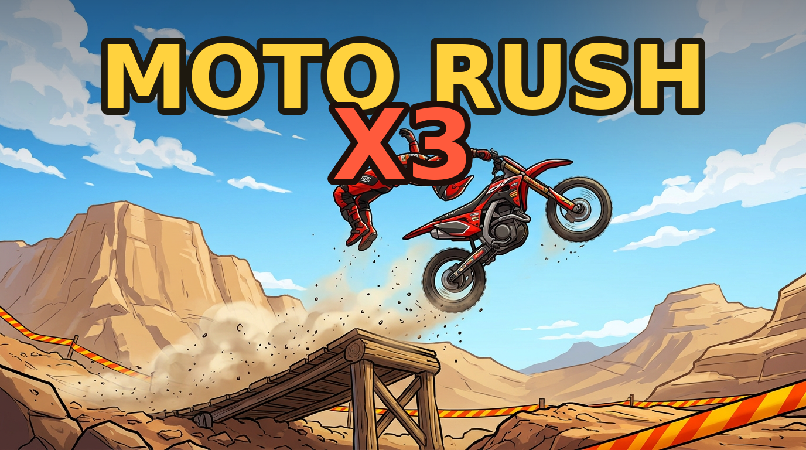
</p>

<h1 align="center">MOTO RUSH X3</h1>

<p align="center"><strong>Send it. Land it. Prove it.</strong></p>

<p align="center">
  An original momentum-driven motorcycle stunt racer with physical landings,
  reactive machinery, deterministic run proofs, and instant browser play.
</p>

<p align="center">
  <a href="https://qemmhd.github.io/motogame/"><strong>PLAY THE CURRENT LIVE BUILD</strong></a>
  &nbsp;&middot;&nbsp;
  <a href="docs/releases/v1.8.1.md">v1.8.1 update</a>
  &nbsp;&middot;&nbsp;
  <a href="docs/releases/v1.8.0.md">v1.8 archive</a>
  &nbsp;&middot;&nbsp;
  <a href="ROADMAP.md">30-update roadmap</a>
  &nbsp;&middot;&nbsp;
  <a href="docs/README.md">documentation hub</a>
</p>

<p align="center">
  
  
  
  
  
  
</p>

---

## Finish Forge gallery

<p align="center">
  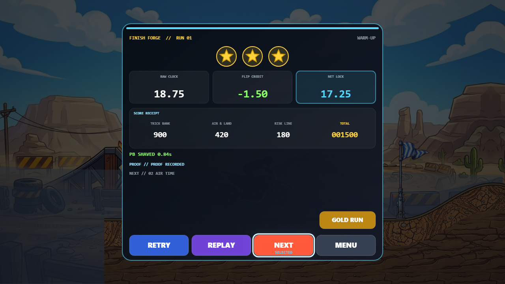
</p>

| Visible action focus | Static Reduced Motion receipt |
|:---:|:---:|
| 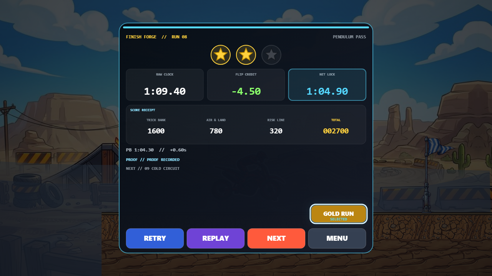 | 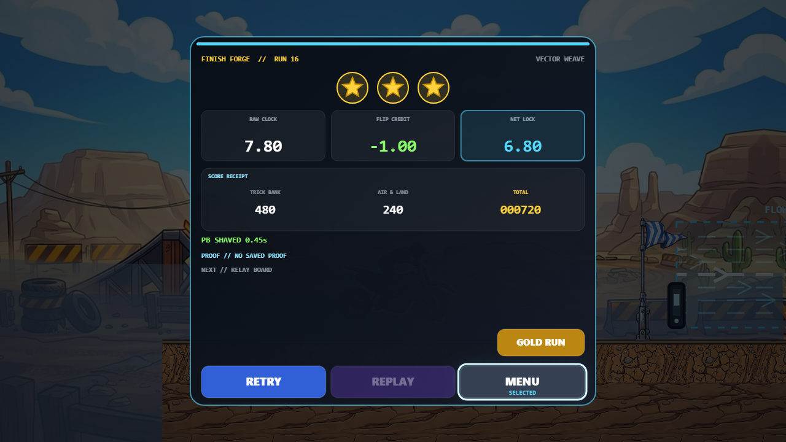 |

<p align="center">
  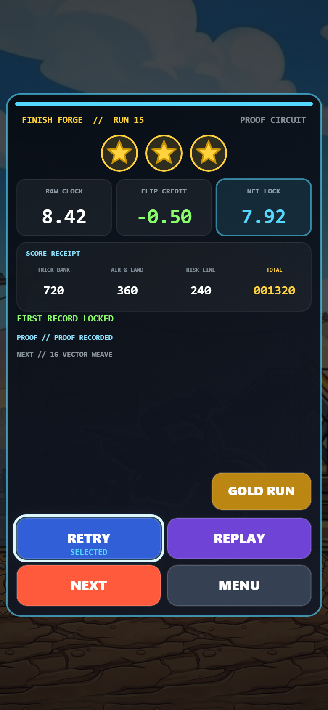
</p>

All four captures are from the real v1.8.1 candidate Canvas, not concept art. Each fixed scene rendered twice in independent clean browser contexts with zero changed pixels and zero maximum channel delta in the recorded pass. They do not claim the public URL already serves v1.8.1.

### Preserved v1.8 Crash Theater gallery

<p align="center">
  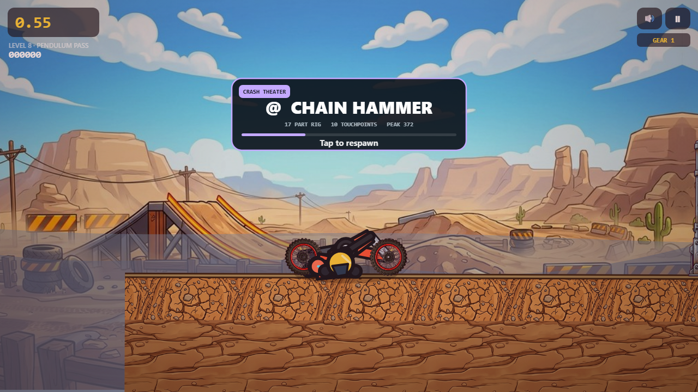
</p>

| Exact ragdoll proxy scene | Static Reduced Motion alternative |
|:---:|:---:|
| 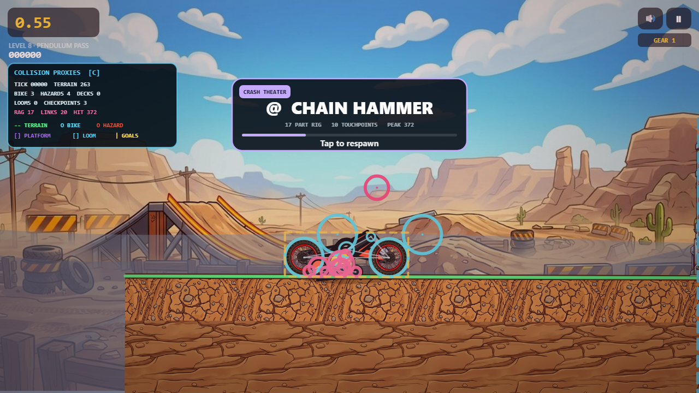 | 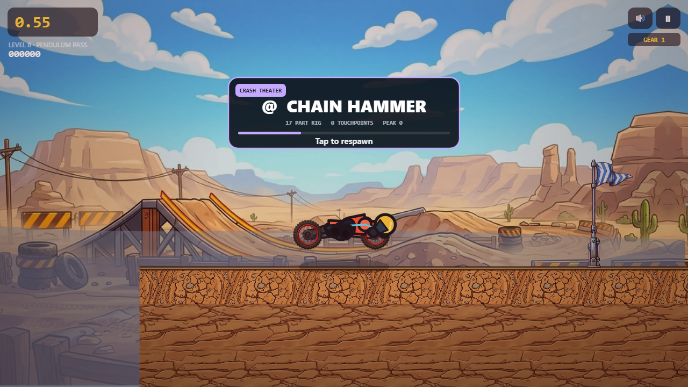 |

<p align="center">
  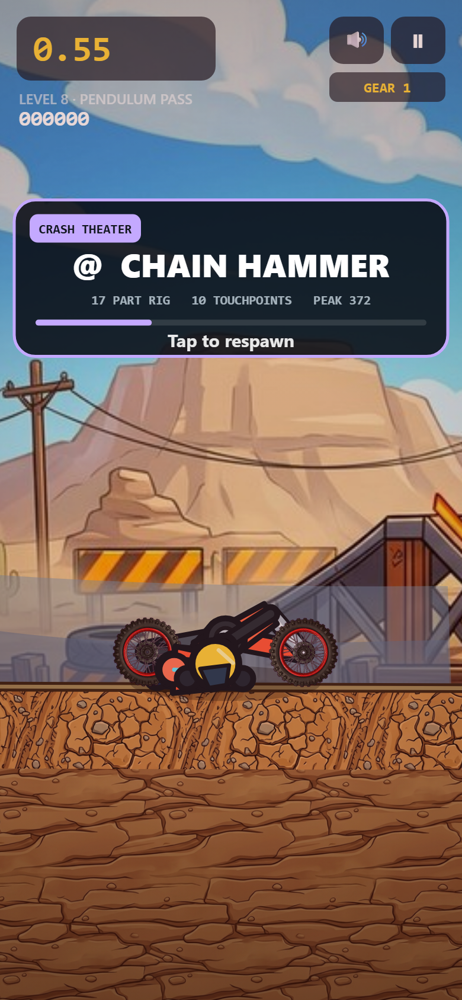
</p>

All four deterministic Canvas captures were inspected at full resolution on 2026-07-14. They show the real candidate runtime, not concept art; they do not claim the public URL is already on v1.8.

### Preserved v1.7 Vector Weave gallery

<p align="center">
  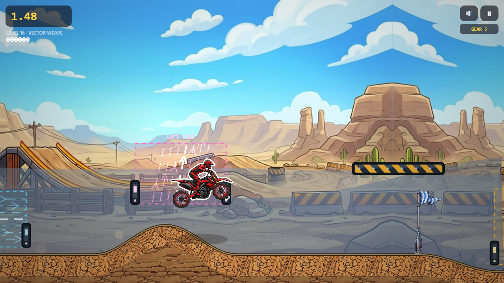
</p>

| Collision-aligned Kinetic Looms | Static Reduced Motion field |
|:---:|:---:|
| 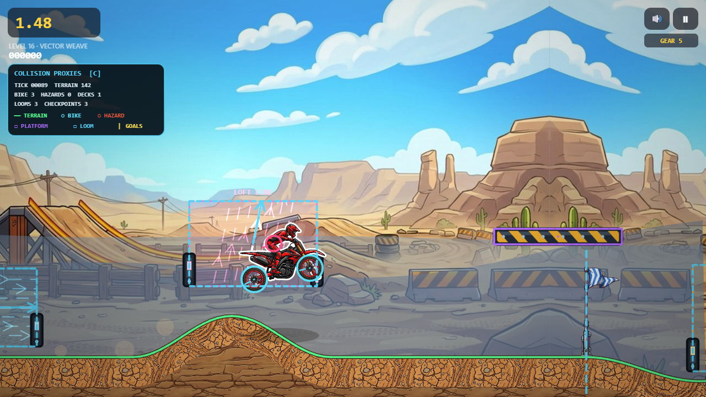 |  |

<p align="center">
  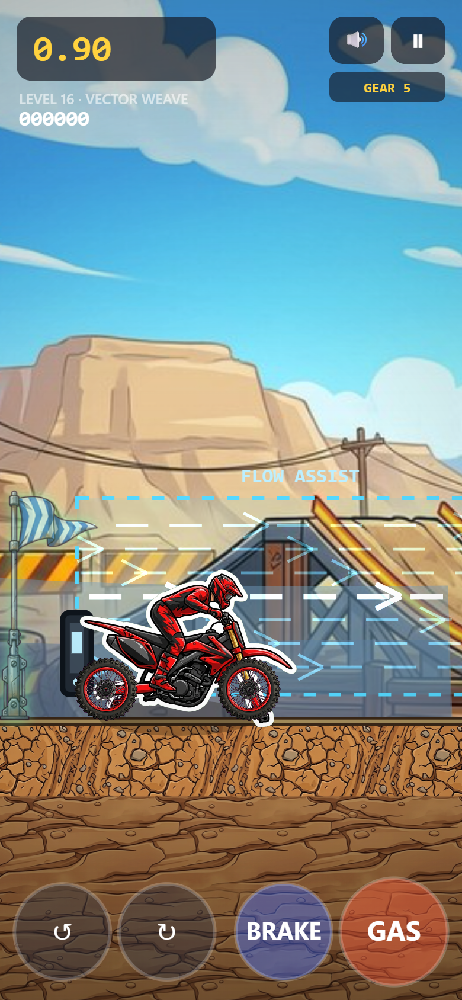
</p>

## The ride

Moto Rush X3 is a browser-first 2D motorcycle game about carrying momentum through hand-built terrain. Its bike has physical wheels, suspension, lean, airborne rotation, graded landings, crash recovery, and distinct surface response. Every course offers readable safe ground, faster stunt lines, and deterministic machinery that rewards timing without replacing rider skill.

The **v1.8.1 Fast Failure, Great Finish** candidate makes both ends of a run readable. A code-native **Splitline** bike-and-rider model turns failure into a deterministic 17-part Crash Theater, while the new **Finish Forge** turns success into an exact run receipt with gross time, flip credit, net time, itemized score, stars, PB delta, proof state, and safe Retry/Replay/Next/Menu/Gold Run actions. Both presentations stay outside authoritative physics and proof state.

### What makes it ours

- **Momentum Machines:** Kinetic Looms, freight decks, sensor lifts, saw patrols, pendulums, crushers, Nitro pressure waves, boost rails, ice, and bouncy membranes reshape a line while preserving player agency.
- **Readable recovery:** checkpoints and forgiving ground routes keep experimentation fast; retries restore exact hazard and platform timelines.
- **Physical feedback:** perfect, clean, rough, and slam landings affect momentum and trigger distinct score, camera, particles, haptics, and audio.
- **Proof-first competition:** compact fixed-tick input tapes carry build, physics, and course identities, then verify their finish tick and authoritative state hash.
- **Original trail anthology:** Canyon Run, Stormworks, and R&D Yard have original names, layouts, systems, tuning, art direction, and presentation.

## Current game

- **16 handcrafted courses** across three original worlds: Canyon Run, Stormworks, and R&D Yard.
- **16 repository Gold Runs**, one for every course, available from results and marked directly on course cards.
- **One authoritative run session** shared by browser play and deterministic tests for bike physics, hazards, moving ground, scoring, checkpoint recovery, crashes, and finishes.
- **Reactive solid platforms** with swept top collision, stable bike carry, bounded inherited velocity, and sensor-triggered local timelines.
- **Crash Theater** with an original 17-part Splitline bike-and-rider rig, ten cause profiles, swept terrain/deck contact, bounded impact telemetry, and a static Reduced Motion alternative.
- **Finish Forge** with exact authoritative time/score receipts, PB and tied-record comparison, guarded progression routes, five explicit actions, semantic dialog parity, and an instant Reduced Motion state.
- **Last-run player proofs** stored locally and clearly rejected when missing, damaged, oversized, level-mismatched, or version-incompatible.
- **Five-band engine response** driven by road speed, load, grounding, and throttle, with landing and stunt audio.
- **Keyboard, Pointer Event, touch, and gamepad input**, including simultaneous controls, interruption cleanup, remappable command metadata, left-handed touch layout, haptics, and reduced motion.
- **Installable offline PWA** with a literal, versioned, test-audited service-worker cache.
- **Local progression** for unlocks, stars, best time, best score, settings, and the most recent completed proof per course.

## What is new in v1.8.1

### One authoritative finish receipt

The DOM-free finish policy accepts the elapsed time, flip credit, finish time, score, and stars already produced by the fixed-step session. It converts time to canonical milliseconds, requires gross minus credit to reconcile with net, and requires every score event to add exactly to the authoritative score. Minute-boundary formatting and personal-best comparisons therefore cannot drift from stored results or invent a zero-millisecond record.

### Five clear ways forward

Retry starts a fresh live run. Replay is separately proof-backed and remains visibly disabled when a compatible player tape is missing. Next exists only when the immediate catalog entry is playable and unlocked; it cannot clamp to the last course, skip missing content, or advance from a malformed current route. Menu is always safe, and Gold Run appears when the repository reference is available.

Arrow keys/WASD, Enter/Space, Escape, standard gamepad D-pad/stick/A/B, pointer, and real touch share the same focus/action policy. Held gamepad controls create no repeat or accidental dismissal edges. Every enabled target is at least 44 × 44 CSS pixels and remains inside the 320 × 568 minimum layout.

### Accessible, responsive presentation

Finish Forge is drawn from Canvas primitives in an original forged-steel and signal-light language. A semantic dialog mirrors its title, exact result summary, disabled state, and buttons; a live region announces completion; the Canvas is keyboard-focusable and browser zoom is not disabled. Reduced Motion reveals the complete receipt immediately and omits confetti without removing result information.

### Clean handoff to the next run

Every result route clears finish focus/timers, semantic controls, announcements, pooled effects and tracks, camera/crash state, pending restart state, UI-input edges, scheduled audio, and active synthesized effect sources. Save records and unlock counts are normalized on read while the existing save key and field meanings remain compatible.

The v1.8.1 local gate passes 3 asset checks, 127 deterministic systems, all 16 physics routes, 32 exact Gold replays, ordinary desktop/mobile performance, three Crash Theater regression profiles, and a dedicated Finish Forge browser matrix in 334.1 seconds. Ordinary callback-work p95 is 1.10 ms desktop and 0.90 ms mobile DPR 2. Chrome 150 Finish Forge recorded 123 desktop callbacks at 0.70 ms p95 and 127 mobile DPR 2 callbacks at 0.60 ms p95, plus native semantic Tab/Enter, repeated-key suppression, keyboard shortcuts, standard fake-gamepad, 320 × 568 geometry, and actual touch-center Retry coverage. Four fixed Canvas scenes rendered twice with zero pixel/channel disagreement. The final draft-PR hosted gate, physical-device/input/assistive-technology smoke, and production Pages/cache/install/offline checks remain pending.

Read the [v1.8.1 release record](docs/releases/v1.8.1.md), [project pickup state](docs/PROJECT_STATE.md), or [Finish Forge capture record](docs/screenshots/v1.8.1/README.md).

## Crash Theater foundation from v1.8

### Splitline crash rig

The crash model now uses 17 independent parts: two wheels, frame, seat, handlebar, hip, torso, head, helmet, two elbows, two hands, two knees, and two feet. Segmented arms and legs, amber joint armor, cyan reflective seams, a separate visor, and a more detailed detached bike are drawn from Canvas primitives, so the model is original, resolution-independent, offline-safe, and does not add a bitmap payload. Structural constraints keep the silhouette readable while cause-specific hand, foot, or full-rider tethers can release.

### Ten readable crash causes

Collision, terrain, platform, saw, spikes, barrel, mace, crusher, TNT, and fallout each normalize into an immutable presentation profile with its own label, accent, glyph, rider/bike impulse balance, and tether-release pattern. Real terrain and one-way-deck head strikes now carry their natural presentation cause from collision into the browser while keeping that metadata out of the proof snapshot; the other authored hazards retain their existing rule reasons. Unknown or malformed reasons fail safely to the collision profile. Crash seeds derive from stable build/level/tick/cause data; entry debris, contact sparks, and camera variation therefore repeat without using presentation randomness as run authority.

### Detached contact and bounded impacts

Crash entry snapshots terrain segments and the current position of each one-way platform. Ragdoll parts query this detached field, including continuous top sweeps that stop a small, fast limb from tunneling through a frozen deck while still allowing upward travel from underneath. The `1 / 120` presentation solver counts friction once per physical substep and stores at most 48 pending impact events; overflow is counted instead of growing memory. The browser drains those detached records into a hard maximum of 28 secondary crash particles plus throttled audio, haptics, and camera feedback.

### Camera, debug, and Reduced Motion

The normal crash camera measures a bounded detached pose, frames rider and bike together, and applies a short seeded hitstop/flash/kick/roll beat. The collision overlay can show ragdoll circles, previous-to-current sweeps, resolved links, contact totals, and peak impact without calling contact authority. Reduced Motion instead creates or freezes a static projected pose, keeps zoom and view height constant, and disables slow motion, hitstop, flash, roll, shake, kick, secondary impact FX, and impact vibration while retaining the cause card and retry message.

### Authority and compatibility

The authoritative crash contract is unchanged: manual retry is still recorded on a fixed tick, automatic checkpoint retry still uses the same `1.85` second session timer, and Crash Theater never writes run, bike, checkpoint, rules, platform, score, or replay-proof state after failure. Build/cache identity advances to `1.8.0`, but replay schema `1`, `physics-4`, and `course-4` remain current. Gold tokens were refreshed only because build identity is part of compatibility; all 16 course outcomes and authoritative state hashes are identical to v1.7 outside version-bearing tokens.

The complete local v1.8 gate passes: 3/3 asset/offline subtests, 108/108 deterministic system subtests, 16/16 physics/rules routes, 16 Gold tapes replayed twice for 32 exact passes, two ordinary browser profiles, and three dedicated crash-browser profiles. The final aggregate run measured ordinary callback-work p95 at **1.00 ms desktop** and **0.81 ms mobile DPR 2**. Unfrozen crash scenes measured **1.60 ms p95** on desktop and **1.50 ms p95** on mobile DPR 2 (181 samples each); the Reduced Motion profile retained pose tick `0`. Every crash profile then held an exact frozen review for 112 tick-equivalent intervals and retried cleanly. Four deterministic Canvas captures were generated twice with zero pixel differences in the recorded run and inspected at full resolution. [Hosted Actions run 29319685056](https://github.com/QemmHD/motogame/actions/runs/29319685056) independently passed the complete gate at gameplay SHA `89e5f7d` and correctly skipped publishing. Physical-device coverage and production smoke remain `pending`.

Read the [v1.8 release record](docs/releases/v1.8.0.md), [project pickup state](docs/PROJECT_STATE.md), or [Gold catalog](docs/qa/GOLDEN_TAPES.md).

## Vector Weave foundation from v1.7

### Kinetic Looms

Each Loom is a readable non-solid field held open by compact steel heads. Woven ribbons and repeated arrowheads show its force direction without relying on color. The bike's rear wheel, front wheel, and head are swept across the full fixed frame, so a fast rider cannot skip a thin field. Overlapping fields contribute once each, sort by stable ID, and enter the bounded impulse hook as one combined change.

The runtime stays stateless: entry, exit, and high-speed crossing are derived from previous/current geometry rather than hidden cooldown memory. Checkpoint retry therefore needs no extra machine snapshot, while malformed or non-finite impulses fail before bike state can be touched.

### Vector Weave

The fourth R&D Yard route teaches three distinct roles over a continuous recovery road:

- **Flow Assist** adds a wide forward current on ordinary ground.
- **Loft Line** bends momentum upward toward an optional sky deck.
- **Soft Landing** shapes the final approach before a shallow dip and whoops.

All three fields have exact collision-debug rectangles and clipped acceleration arrows. The level has three checkpoints, no lethal hazards, a forgiving lower line, and a verified zero-recovery Gold reference.

### Preserved v1.7 proof and visual evidence

The archived v1.7 candidate advanced to build `1.7.0`, `physics-4`, and `course-4` while retaining replay schema `1`. All 16 Gold tapes verified twice. The first 15 retained their exact prior outcomes and final state hashes outside required version-bearing tokens. Four browser captures document clean desktop play, exact proxy alignment, 390 × 844 DPR 2 touch framing, and static Reduced Motion ribbons.

Read the screenshot-backed [v1.7 release record](docs/releases/v1.7.0.md), the [capture record](docs/screenshots/v1.7/README.md), or the exact [Gold catalog](docs/qa/GOLDEN_TAPES.md).

## Smooth Ride foundation from v1.6

### Bounded effects that reuse memory

Dust, debris, smoke, sparks, confetti, score popups, and tire tracks run through fixed-capacity pools instead of growing arrays and per-frame filters. The complete presentation budget is a hard **636 live items**: 384 particles, 32 popups, and 220 tracks. Saturation deterministically reuses the oldest slot, and reset clears active state without reallocating pool storage.

### Frame health you can inspect

A fixed-ring telemetry module records frame time, simulation ticks, catch-up pressure, clamped time, viewport changes, and effect-pool activity without allocating a new sample object each frame. Development telemetry reports FPS, mean, p50, p95, p99, maximum frame time, slow frames, effect peaks, reuse, and evictions.

The final v1.7 full-gate local headless Chrome reference measured **1.00 ms desktop main-loop work p95** against an 8 ms regression budget and **2.20 ms mobile DPR 2 work p95** against a 12 ms budget. [Hosted Actions run 29307193559](https://github.com/QemmHD/motogame/actions/runs/29307193559) passed the same v1.7 gate at **1.10 ms** for both profiles; scheduler pacing remained diagnostic. These figures are reproducible automation evidence, not physical-device certification.

### Interruption-safe input

Ride commands now pass through an extracted DOM-free state machine. It resolves keyboard, multiple pointers, gamepad snapshots, and development input into one stable command view. Pointer cancel, lost capture, window blur, hidden tabs, and orientation changes clear held state so a rider cannot remain stuck on gas or lean after an interruption.

The responsive gate also checks the narrow 320 × 568 layout: every touch target remains inside the viewport and opposing Gas/Brake or Lean zones cannot overlap. Connected gamepads are sampled once per rendered frame, and unchanged samples do not create diagnostic-event churn.

### Left-handed touch play

The accessibility setting can mirror the touch clusters without changing the ride model. Layout changes and screen rotation invalidate stale pointer ownership before play resumes, preserving predictable input in either orientation.

### Cached presentation work

Reusable gradients, camera accumulators, ragdoll lookup state, and bounded effect iteration remove avoidable hot-path garbage while leaving authoritative fixed-step physics and Gold Run compatibility separate from presentation.

Read the screenshot-backed release record in [docs/releases/v1.6.0.md](docs/releases/v1.6.0.md), or inspect the exact profiling method and budgets in [docs/qa/PERFORMANCE.md](docs/qa/PERFORMANCE.md).

## Controls

| Action | Keyboard | Touch / pointer |
|---|---|---|
| Accelerate | Up arrow or `W` | Gas button |
| Brake / reverse | Down arrow or `S` | Brake button |
| Lean back / backflip | Left arrow or `A` | Left rotate button |
| Lean forward / frontflip | Right arrow or `D` | Right rotate button |
| Pause | `Esc` or `P` | Pause button |
| Restart level | `R` | Retry button / paused menu |
| Retry checkpoint after crash | Space, Enter, or primary action | Tap the crash overlay |
| Replay the player's finish | Results screen | Replay button |
| Play repository reference | `G` on results | Gold Run button |
| Toggle collision proxies | `C` in development mode | Development-only |

Touch players can select the standard or left-handed layout from Settings.

## Run locally

The shipped game has no compilation step. Serve `public/` through HTTP:

```powershell
python -m http.server 8080 --directory public
```

Open `http://127.0.0.1:8080/`.

Install the pinned repository tooling and run the complete release gate:

```powershell
npm ci
npm test
```

The v1.8.1 candidate gate covers:

- 3 asset and offline subtests;
- the expanded deterministic system suite, including finish policy, UI edges, exact session finishes/stars, release metadata, and every preserved subsystem;
- all 16 authored physics and rules routes;
- all 16 Gold Runs replayed twice in clean browser contexts, for 32 replay passes;
- 2 repeatable ordinary browser performance/input profiles: desktop and mobile DPR 2;
- 3 dedicated crash-browser profiles: desktop TNT, mobile DPR 2 saw, and Reduced Motion crusher;
- 2 strict Finish Forge browser profiles with keyboard, touch, standard gamepad, semantic, route-safety, target-geometry, Reduced Motion, and reset assertions.

Focused commands:

```powershell
npm run test:session
npm run test:kinematics
npm run test:force-zones
npm run test:crash-contact
npm run test:crash-presentation
npm run test:ragdoll
npm run test:debug
npm run test:input
npm run test:effects
npm run test:performance
npm run test:ui-actions
npm run test:release-metadata
npm run test:browser-performance
npm run test:browser-crash
npm run test:browser-results
npm run test:goldens
npm run capture:v181
```

Useful development routes:

- `?dev&level=13` — Freight Flight.
- `?dev&level=14` — Lift Logic and its sensor deck.
- `?dev&level=16&autoplay` — Vector Weave and all three Kinetic Looms.
- `?dev&level=16&debug=collisions` — aligned Loom, bike, terrain, platform, and goal proxies.
- `?dev&level=16` — open the development console and call `__moto.stageCrash({ type: 'mace', presentationTicks: 36 })` for a deterministic Crash Theater scene.
- `?dev&level=16&debug=collisions` — after staging a crash, inspect the 17 node circles, swept histories, links, contacts, and impact metrics.
- `?dev&finish&capture&level=1` — stage a deterministic Finish Forge receipt for responsive and semantic inspection.
- `?dev&level=14&perf` — live frame and effect telemetry.
- `?dev&touch` — forced touch layout for desktop inspection.

## Project reference

| Section | Purpose |
|---|---|
| [Documentation hub](docs/README.md) | Release, QA, screenshot, architecture, and handoff index |
| [v1.8.1 Finish Forge brief](docs/releases/v1.8.1.md) | Current player-visible and technical update with exact arithmetic, input/reset/accessibility contracts, four inspected captures, and explicit delivery limits |
| [v1.8 Crash Theater brief](docs/releases/v1.8.0.md) | Preserved screenshot-backed failure-presentation predecessor |
| [v1.7 Vector Weave brief](docs/releases/v1.7.0.md) | Preserved screenshot-backed predecessor |
| [Performance QA](docs/qa/PERFORMANCE.md) | Browser profiles, p95 budgets, method, and evidence limits |
| [Golden Run QA](docs/qa/GOLDEN_TAPES.md) | Exact 16-course proof catalog and regeneration policy |
| [Screenshot archive](docs/screenshots/README.md) | Versioned visual progress instead of overwritten images |
| [30-update roadmap](ROADMAP.md) | Dependencies, promises, status, evidence, and acceptance gates |
| [Changelog](CHANGELOG.md) | Permanent chronological release record |
| [Project state](docs/PROJECT_STATE.md) | Canonical current branch and build pickup note |
| [Architecture](docs/ARCHITECTURE.md) | Runtime modules, fixed-step flow, and invariants |
| [Feel specification](design/FEEL_SPEC.md) | Bike feel and feedback targets |
| [Asset inventory](design/assets.csv) | Art-production tracking |
| [ISC license](LICENSE) | Use, modification, and distribution terms |

## Repository layout

```text
public/                 Shipped game, PWA shell, runtime modules, levels, assets, Gold Runs
tools/                  Deterministic systems, route gates, browser profiles, replay verifier
docs/releases/          Screenshot-backed release briefs
docs/qa/                Reproducible QA records, measurements, and policies
docs/screenshots/       Versioned desktop, mobile, gameplay, debug, and proof captures
design/                 Feel specification and production asset inventory
.github/                Test-gated Pages workflow and contribution templates
```

## Project information

| | |
|---|---|
| **Current candidate** | v1.8.0 — Crash Theater |
| **Draft review** | [PR #3 — Ship v1.8.0: Crash Theater](https://github.com/QemmHD/motogame/pull/3) |
| **Gameplay commit** | [`89e5f7d9757e`](https://github.com/QemmHD/motogame/commit/89e5f7d9757eb90ae1f58f5dfd6914d5aaa7aad4) |
| **Hosted QA** | [Actions 29319685056](https://github.com/QemmHD/motogame/actions/runs/29319685056) passed; publish skipped |
| **Course count** | 16 across three worlds |
| **Reference coverage** | 16/16 repository recovery tapes, each verified twice |
| **Effects ceiling** | 636 live items across particles, popups, and tracks |
| **Format** | Static HTML, CSS, Canvas 2D, and native JavaScript modules |
| **Distribution** | GitHub Pages / installable PWA |
| **Canonical game** | <https://qemmhd.github.io/motogame/> |
| **Persistence** | Browser `localStorage`; no account or backend required |
| **Target** | Desktop and mobile browsers |

## Release-candidate honesty

`v1.8.0` describes the unmerged candidate in draft [PR #3](https://github.com/QemmHD/motogame/pull/3). Its local cumulative gate, hosted gate, and four-image gallery are complete; the physical-device matrix and production deployment are still `pending`. The public play link may remain on an earlier production build until the candidate is reviewed, merged to an eligible branch, published by GitHub Pages, and smoke-tested at the canonical URL.

The performance numbers above come from the documented local headless Chrome profiles. They protect against repeatable regressions; they do not replace physical-device testing across different chipsets, thermal states, browsers, or refresh rates. Gold Runs are deterministic automation recovery references, not claims of clean human mastery or final star-time balance.

The R&D Yard remains a focused four-course lab, and current moving platforms are axis-aligned one-way decks. Safe/apex human tape pairs, wheelie balance feedback, richer surface audio, general moving/closed collision geometry, breakable terrain, more worlds, personal-best ghosts, challenge links, and Trail Forge remain on the roadmap.

## Originality promise

Moto Rush X3 learns from broad side-scrolling motorcycle and stunt-racing conventions, but it does not decompile competitors or copy proprietary code, assets, audio, UI layouts, exact tracks, or timing data. Its mechanics, code, names, layouts, tuning, visuals, and documentation are created for this project.

## Credits

Created and directed by [QemmHD](https://github.com/QemmHD). Engineering and production progress stays in this repository so every future update can resume from reviewable code, tests, images, measurements, and written state.
