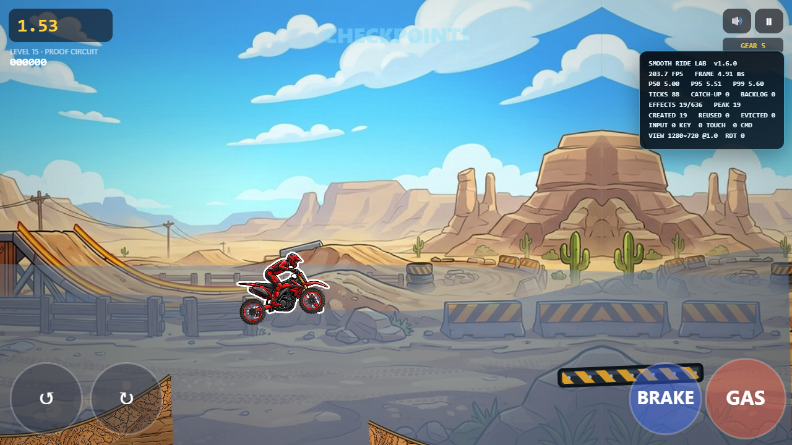
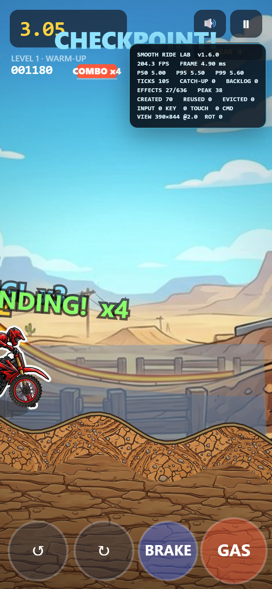
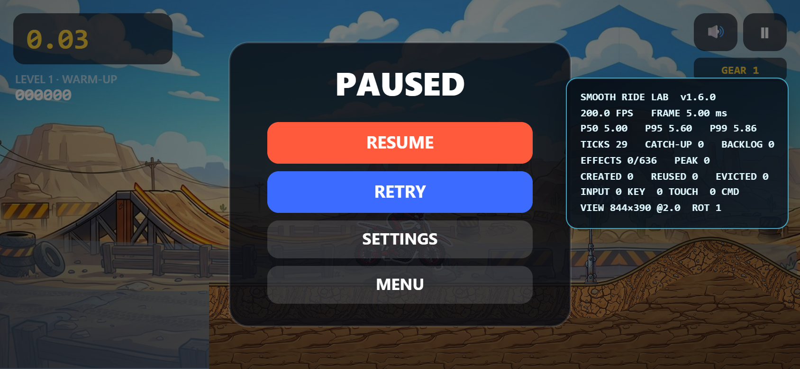
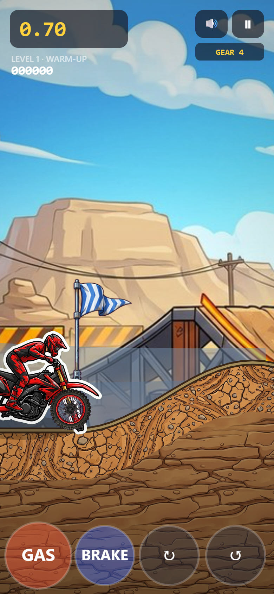
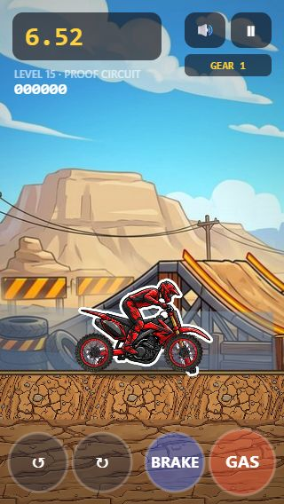
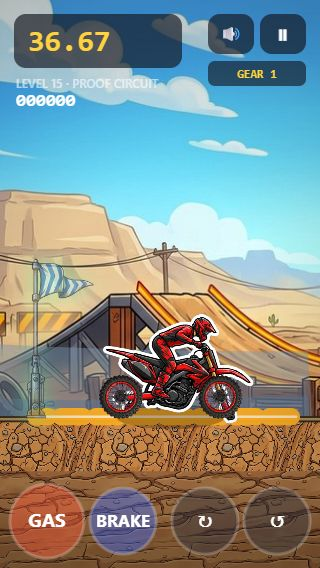

# Performance and Interruption QA

This document is the reproducible acceptance record for the v1.6.0 **Smooth Ride** runtime work. It separates what the automated browser gate proves from what still requires physical-device testing.

## Acceptance profiles

| Profile ID | Viewport | DPR | Browser context | Frame-work p95 budget |
|---|---:|---:|---|---:|
| `desktop-1280x720-dpr1` | 1280 × 720 | 1 | desktop, no touch | < 20 ms |
| `mobile-390x844-dpr2` | 390 × 844 | 2 | mobile context, touch enabled | < 25 ms |

The latest standalone run used a local **system-installed Chrome in headless mode**. It did not use a hosted browser, a production Pages build, or a physical phone.

## Latest measured result

| Profile | Work samples | Work p50 | Work p95 | Work p99 | Pacing p95 | Work budget | Status |
|---|---:|---:|---:|---:|---:|---:|---|
| Desktop 1280 × 720 @1 | 360 frames | 0.40 ms | 0.60 ms | 1.12 ms | 7.20 ms | p95 < 20 ms | Pass |
| Mobile 390 × 844 @2 | 360 frames | 0.30 ms | 0.70 ms | 2.82 ms | 10.70 ms | p95 < 25 ms | Pass |

Both callback-work p95 measurements are below their repository budgets. `Work` is the synchronous duration of the game's animation-frame callback, including fixed-step updates, presentation updates, and canvas command submission. `Pacing` is the existing runtime's callback-to-callback wall interval; it remains visible as a diagnostic but is not gated on shared CI because host scheduling dominates it. Neither view is a universal performance guarantee or a physical-display FPS/GPU claim.

## Browser harness procedure

`npm run test:browser-performance` starts a temporary static server for `public/`, locates an installed Chrome/Chromium/Edge browser, and runs the two profiles sequentially. For each profile it:

1. Creates a clean context with the profile viewport, DPR, mobile, and touch settings.
2. Injects a preallocated 360-value wrapper around `requestAnimationFrame` before any game script runs; the wrapper records only synchronous callback work.
3. Blocks service workers so cached files cannot hide a missing runtime dependency.
4. Opens level 1 with development capture, touch, and autoplay flags.
5. Captures page and console errors across measurement and the complete interaction matrix.
6. Warms the runtime for 750 ms, then resets the runtime telemetry and harness probe together.
7. Measures for at least 3 seconds. If the host has not produced 180 frames, it waits up to 7 more seconds for the same target; a timeout still produces the measured snapshot and an actionable failure.
8. Prints browser version plus complete work and pacing diagnostics before assertions, requires matching probe/runtime sample counts, active play, at least 60 fixed ticks, and nonzero pooled-effect activity.
9. Requires main-loop work p95 to remain below the profile budget while retaining pacing p95 as a diagnostic.
10. Validates that active/created/peak effects stay within each fixed pool capacity.
11. Runs the interruption and control-layout matrix on the mobile profile, including 390 × 844 and 320 × 568 target separation.
12. Closes each context, the browser, and the temporary server even if an assertion fails.

Reproduce it from the repository root:

```powershell
npm ci
npm run test:browser-performance
```

Run the DOM-free telemetry and pool/input unit gates separately:

```powershell
npm run test:effects
npm run test:input
npm run test:performance
```

## Telemetry design

The live recorder uses eight preallocated typed arrays in a fixed **360-frame rolling ring** for callback-to-callback wall interval, fixed ticks, backlog ticks, dropped time, clamped time, active effects, pooled/created effects, and effect capacity. The record path validates and clamps numeric samples, writes the current slot, and updates scalar counters. It does not grow an array or construct a per-frame report.

The browser harness adds a separate test-only 360-value `Float64Array` ring around the one game animation callback. This separates synchronous main-loop work from time spent waiting for a hosted browser to schedule the next callback. Its reset and record paths reuse fixed storage; only the requested final snapshot copies and sorts values.

A snapshot is an explicit cold-path operation. It copies the current window, sorts the frame-time values, and produces a detached object containing:

- FPS, mean frame time, p50, p95, p99, maximum, and slow-frame totals;
- total fixed ticks, catch-up frames/ticks, backlog frames/ticks, and peak backlog;
- clamped/dropped frame counts and accumulated time;
- current and peak active/pooled/capacity effect counts;
- viewport size, DPR, rotation, focus, and pointer-cancel counters.

The in-game `?dev&perf` overlay asks for this snapshot at a throttled interval. The browser loop consumes at most five fixed ticks per rendered frame and retains at most six queued ticks, making backlog and dropped-time counters real bounded pressure signals. Telemetry is diagnostic presentation, not authoritative simulation state and not part of a replay hash.

## Effect-capacity invariants

| Pool | Capacity | Harness invariant |
|---|---:|---|
| Particles | 384 | active, created, and peak are each ≤ 384 |
| Popups | 32 | active, created, and peak are each ≤ 32 |
| Tracks | 220 | active, created, and peak are each ≤ 220 |
| **Combined** | **636** | telemetry peak never exceeds combined capacity |

Storage is bounded. A pool lazily creates at most one reusable value per slot. If all slots in one pool are active, its oldest active effect is evicted deterministically; the pool never expands. Release/clear operations return slots to the fixed free list, and active iteration does not build a temporary effect collection.

## Mobile interruption matrix

After the mobile performance sample, the harness exercises control ownership and state transitions:

| Case | Automated assertion |
|---|---|
| Control separation | Standard and left-handed Gas/Brake plus Lean hit circles are disjoint and unclipped at 390 × 844, 320 × 568, and rotated 844 × 390 layouts. |
| Simultaneous touch | Separate Gas and Lean Back pointers are both present in the aggregate command. |
| Pointer cancel | Cancelling the Gas pointer releases Gas only; the Lean Back pointer stays active and the cancel counter increments. |
| Blur | A held keyboard Gas command becomes neutral, the run pauses, and `blur` is retained as the clear reason. |
| Rotation | A held touch becomes neutral, the run pauses, rotation count increments, and the canvas becomes 844 × 390. |
| Left-hand setting | Settings enable left-handed layout metadata; Gas maps to the left cluster and Lean Back to the right cluster. |

The runtime also clears active commands when the document becomes hidden. The input module has deterministic coverage for pointer end, pointer cancel, lost pointer capture, keyboard remapping, gamepad snapshots/deadzone behavior, development input, event bounds, invalid input rejection, and clear/pause reasons.

## Visual evidence

| Desktop live sample | Mobile live sample |
|:---:|:---:|
|  |  |

| Rotation assertion | Left-hand layout assertion |
|:---:|:---:|
|  |  |

| 320 px standard targets | 320 px left-hand targets |
|:---:|:---:|
|  |  |

These screenshots show the live runtime and telemetry panel. They are supporting visual evidence, while the command's pass/fail assertions remain the repeatable acceptance mechanism.

## Interpretation and limits

This gate is designed to catch regressions such as an effect array growing without bound, fresh effect identity churn, synchronous main-loop work moving beyond budget, fixed-step backlog, stale controls after pointer cancellation, or layout/input ownership disagreeing after rotation. Pacing remains visible to expose scheduler stalls, but it is not confused with the callback-work regression budget.

It does not substitute for profiling a production build on physical hardware. Before production release, record a comparable 10+ minute run on representative low/mid-tier Android hardware and an iPhone-class device. Include heavy dust/confetti/crash scenes, repeated retries, portrait/landscape rotation, background/foreground, real multi-touch, audio, haptics, browser UI expansion/collapse, thermal behavior, and battery impact. Also smoke-test the published GitHub Pages URL with a clean cache and an installed offline PWA.
