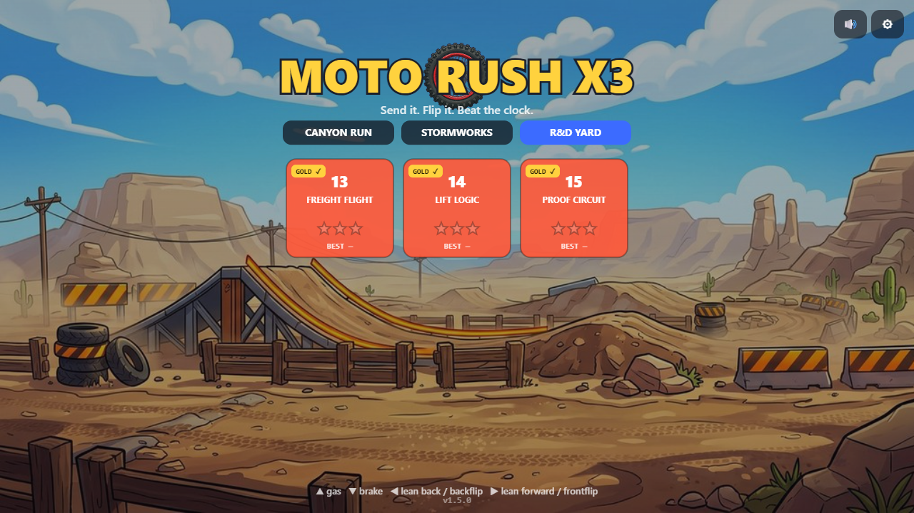
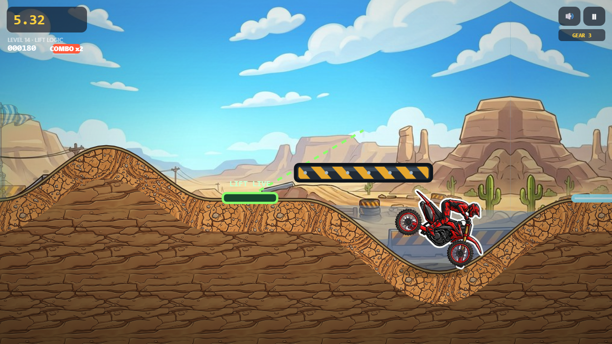
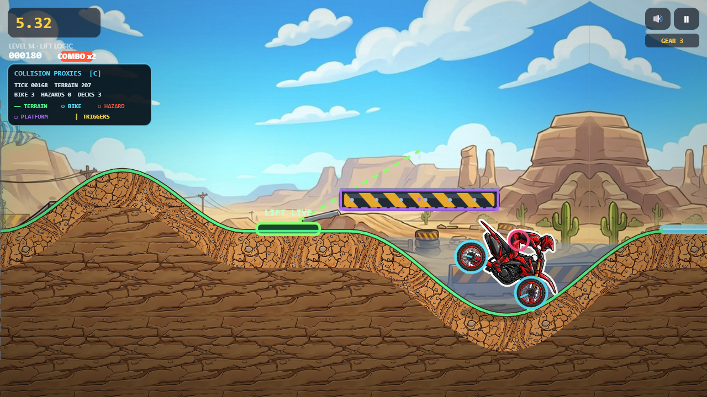
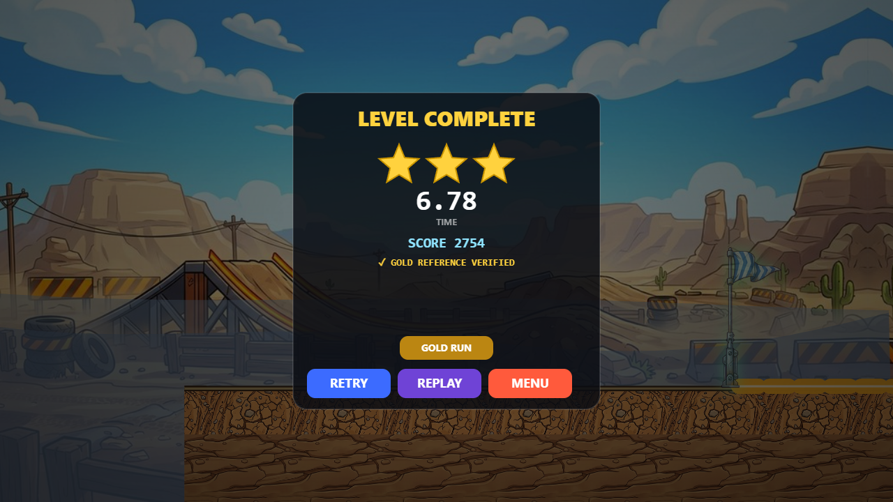
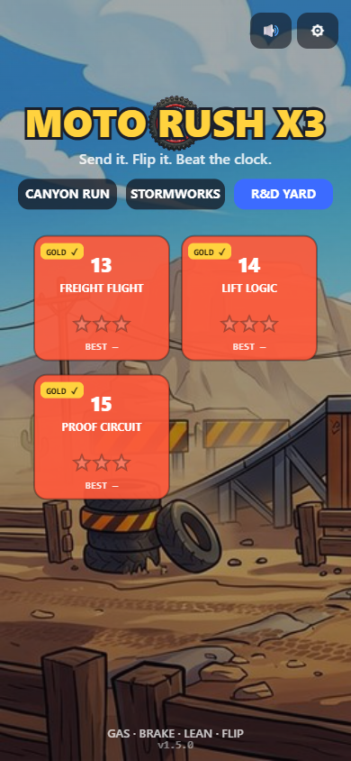

# v1.5.0 — Gold Standard

Release-candidate date: **2026-07-13**

Moto Rush X3 v1.5 turns deterministic replay from a single-run feature into a repository-owned proof system. Every current course now has a browser-recorded recovery run that can be launched from the game and verified against its exact fixed-tick finish state. Lift Logic also gains the first sensor-triggered moving deck, and development mode can draw collision geometry directly over the art.

This branch is still a release candidate. It is not described as production-live until it is merged through an eligible branch, GitHub Pages publishes it, and the canonical URL passes cache/offline smoke testing.

## Player-facing changes

- Every one of the 15 course cards has a **GOLD ✓** reference badge.
- Completed-course results include a **GOLD RUN** action in addition to Retry, Replay, and Next/Menu.
- Gold playback ends with **GOLD REFERENCE VERIFIED** only when the finish tick and authoritative state hash match.
- Saved proofs that are missing, stale, oversized, or damaged now produce an explicit player-facing notice instead of failing silently.
- Lift Logic introduces a visible **LIFT SENSOR**. Crossing it starts the deck's local motion timeline and changes the marker to **LIFT LIVE**.
- Platform activation gets an original visual/audio/camera cue while preserving the recoverable ground route.

## Runtime and tool changes

- `public/run-session.js` is now the DOM-free authority for terrain, bike physics, hazards, moving platforms, scoring, checkpoint state, crash/respawn timing, and finish results.
- The browser controller records/selects input, advances the run session once per fixed tick, and translates plain session events into sound, particles, haptics, camera feedback, ragdoll presentation, persistence, and UI.
- Triggered platforms carry explicit `startActive`, `triggerX`, `active`, `activationTick`, and local `motionTick` state.
- Kinematic checkpoint snapshots preserve previous/current poses and activation state. Malformed or mismatched restores are validated atomically before mutation.
- `public/debug-proxies.js` creates finite, detached render snapshots for terrain segments, wheel/head circles and sweeps, hazards, platforms, checkpoints, and finish triggers.
- Development mode toggles the aligned proxy view with `C` or starts with `?dev&debug=collisions`.
- `tools/generate-golden-tapes.mjs` records every built level through a local Chrome/Chromium runtime without external network access.
- `tools/verify-golden-tapes.mjs` decodes the manifest, checks runtime/catalog compatibility, and replays every tape twice in clean browser contexts.
- `package-lock.json` is now repository-owned so local and CI tooling resolve the same browser automation dependency.

## Visual evidence

| Repository Gold Runs | First sensor-controlled deck |
|:---:|:---:|
|  |  |

| Collider-to-art audit | Verified repository proof |
|:---:|:---:|
|  |  |

<p align="center">
  
</p>

## Verification evidence

The final release gate is `npm test`:

1. 3 asset/offline subtests.
2. 44 deterministic system subtests.
3. All 15 authored routes through the physics/rules gate.
4. All 15 repository tapes replayed twice in clean browser contexts: 30 verified runs with no divergence.

Focused commands:

```powershell
npm run test:session
npm run test:kinematics
npm run test:debug
npm run test:goldens
```

Regenerate references only after an intentional build, physics, course, or fixed-step behavior change:

```powershell
npm run generate:goldens
npm run test:goldens
```

## Scope honesty

The checked-in tapes are deterministic **recovery references**, produced by the repository's hazard-aware automation. They prove completion, compatibility, fixed-tick repeatability, and replay verification. They do not prove ideal human lines, balanced star targets, clean runs, touch difficulty, or fun. Pendulum Pass and Stormbreak intentionally retain multiple recoveries in the current references; safe/apex human tape pairs remain a separate U10/U14 acceptance task.

The collision overlay is a development audit view, not a player setting. Current moving platforms remain axis-aligned one-way top colliders; rotating platforms, arbitrary moving chains, force zones, and breakable ground remain future roadmap work.
