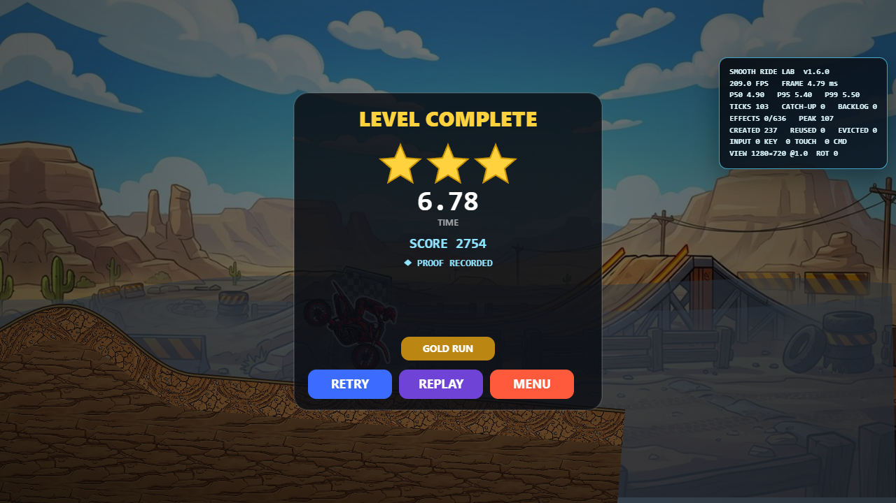
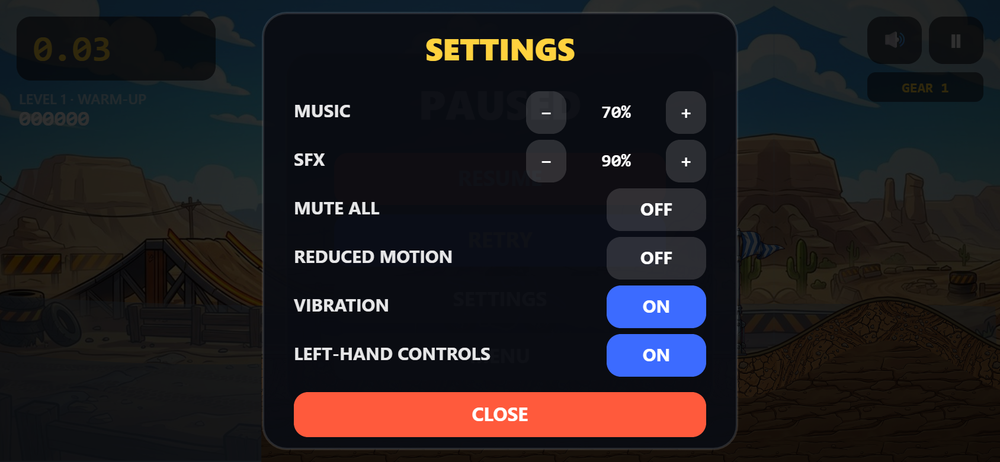

# v1.6.0 — Smooth Ride

Release-candidate date: **2026-07-13**

Moto Rush X3 v1.6 hardens the parts of a browser game that are easy to miss until a long session or interrupted phone run exposes them. Visual effects now live in fixed-capacity reusable pools, the fixed-step adapter reads a unified input state without allocating a command object every tick, and a bounded telemetry ring reports real frame percentiles, simulation catch-up, effect pressure, viewport changes, and interruption events.

This is a release candidate, not a production-live claim. The repository gate passes in a local, system-installed headless Chrome at desktop and emulated mobile viewports. A physical-phone pass, real touch/audio/haptics checks, production GitHub Pages smoke test, and cache/offline validation remain open before the release can be called store-ready.

## Player-facing changes

- **Left-hand controls** can be enabled in Settings. Gas and Brake move to the left side while the two lean controls move to the right, and the choice is retained with the rest of the settings.
- **Safer interrupted runs:** blur, a hidden page, or device rotation neutralizes every active command and pauses an in-progress run. A stale touch can no longer keep Gas, Brake, or Lean held after the game loses control of the pointer.
- **Independent multi-touch:** Gas/Brake and Lean are aggregated by pointer identity, so releasing or cancelling one finger does not release a different finger's command.
- **Rotation-aware layout:** changing between portrait and landscape updates the canvas, clears controls, and presents the paused menu before play can continue.
- **Narrow-phone target separation:** at 320 × 568, standard and left-handed clusters remain inside the viewport and opposing command hit circles cannot overlap.
- The development-only **Smooth Ride Lab** panel makes frame percentiles, fixed ticks, backlog, effect pressure, reuse, evictions, input ownership, DPR, and rotation count visible over live play.

## Bounded effect runtime

Particles, score popups, and tire tracks no longer grow and filter ordinary arrays during every gameplay frame. Each category has a hard cap and reuses stable identities:

| Pool | Capacity | Intended content |
|---|---:|---|
| Particles | 384 | dust, exhaust, fire, smoke, sparks, debris, and finish confetti |
| Popups | 32 | combo, score, checkpoint, and event callouts |
| Tracks | 220 | short-lived tire marks |
| **Total** | **636** | hard upper bound across pooled visual effects |

The pool keeps preallocated slot metadata, reuses released objects, and evicts the oldest active effect deterministically only if a category reaches its cap. Generation-aware leases prevent an expired handle from releasing a newer effect that reused the same slot. Update and draw passes can walk active slots without building a temporary array, while explicit diagnostic snapshots remain detached from live state.

These pools are presentation-only. They do not enter the authoritative run snapshot or Gold Run state hash, so visual pressure cannot change bike physics, hazards, checkpoints, scoring, or replay verification.

## Frame and allocation telemetry

`public/perf-metrics.js` owns a **360-frame typed-array ring** in the browser integration. Recording a frame writes numeric data into preallocated buffers; percentile sorting and detached report objects are created only when a caller explicitly asks for a snapshot.

The recorder tracks:

- frame duration, mean FPS, p50, p95, p99, maximum, and slow-frame count;
- fixed ticks, catch-up frames/ticks, current and peak backlog, clamped time, and dropped time;
- active, created/pooled, peak, and total-capacity effect counts;
- viewport width/height, DPR changes, rotation, focus, and pointer-cancel events.

The development overlay is available with `?dev&perf`. It is an engineering view and is intentionally not exposed as a normal player setting.

## Extracted input ownership

`public/input-state.js` now combines keyboard, multi-pointer, gamepad snapshots, and development automation into one command state. The fixed-step browser adapter reads that state into a caller-owned target, avoiding a fresh per-tick command object. Connected gamepads are polled once per rendered frame into reusable scratch state, and unchanged controller commands do not emit new diagnostic events.

Input clearing records the reason and can recommend a pause for blur, hidden-page, or rotation interruptions. Pointer end, pointer cancel, and lost pointer capture release only the matching pointer. Key bindings are configurable at the module boundary, gamepad inputs use a deadzone-aware snapshot, and left-handed layout metadata keeps the visual control clusters and command ownership aligned.

## Visual evidence

| Live desktop telemetry | Desktop completion pressure |
|:---:|:---:|
|  |  |

| Mobile performance profile | Rotation-safe pause |
|:---:|:---:|
|  |  |

| Left-hand setting | Left-hand play layout |
|:---:|:---:|
|  |  |

| 320 px standard layout | 320 px left-hand layout |
|:---:|:---:|
|  |  |

The complete file list and capture descriptions are preserved in the [v1.6 screenshot record](../screenshots/v1.6/README.md).

## Browser performance evidence

The latest standalone browser run used the repository harness and a local system-installed Chrome in headless mode. Service workers were blocked, each profile warmed for 750 ms, runtime telemetry and the bounded callback-work probe were reset together, and the next 3 seconds filled both 360-sample rolling windows.

| Profile | DPR | Work p50 | Work p95 | Work p99 | Pacing p95 | Work budget | Result |
|---|---:|---:|---:|---:|---:|---:|---|
| Desktop 1280 × 720 | 1 | 0.40 ms | 1.00 ms | 3.38 ms | 3.70 ms | < 20 ms | Pass |
| Mobile 390 × 844 | 2 | 0.40 ms | 0.81 ms | 2.44 ms | 3.70 ms | < 25 ms | Pass |

Work percentiles measure synchronous main-loop callback duration; pacing p95 is the callback-to-callback wall interval and remains diagnostic because browser scheduling varies by host. Neither value is a display-refresh, compositor/GPU, or physical-device claim. See [Performance and interruption QA](../qa/PERFORMANCE.md) for the full method, invariants, input matrix, interpretation, and limitations.

## Complete verification gate

The v1.6 `npm test` gate covers:

1. **3 asset/offline tests** for the shipped public surface.
2. **76 deterministic system tests** across rules, replay, kinematics, ragdoll, run session, collision proxies, effect pooling, input state, and performance metrics.
3. **15 authored routes** through the physics/rules gate.
4. **15 Gold recovery tapes replayed twice** in clean browser contexts: 30 verified browser runs with no divergence.
5. The two-profile browser performance and interruption gate described above.

Reproduce the complete gate:

```powershell
npm ci
npm test
```

Focused Smooth Ride checks:

```powershell
npm run test:effects
npm run test:input
npm run test:performance
npm run test:browser-performance
```

## Scope honesty and remaining release work

The automated mobile profile is Chrome viewport/touch emulation on a desktop-class machine. It verifies active simulation/effect progress, canvas sizing, DPR bookkeeping, pooled-effect bounds, disjoint and unclipped 390 × 844 / 320 × 568 control zones, command aggregation, cancel behavior, blur clearing, rotation clearing/pausing, left-handed layout metadata, and the absence of page/console errors after interactions. It does **not** prove real-device GPU/CPU thermals, Safari behavior, Android browser chrome, OS gesture conflicts, physical multi-touch ergonomics, audio focus, haptics, battery use, or notch/safe-area behavior.

Before calling v1.6 production-ready, run at least one representative iPhone-class and Android-class physical-device session, including portrait/landscape rotation, background/foreground, incoming-interruption recovery, left- and right-hand layouts, audio/haptics, 10+ minutes of continuous effects, installation, offline relaunch, and an eligible-branch GitHub Pages publish. The canonical production URL must then pass a clean-cache and installed-PWA smoke test.
