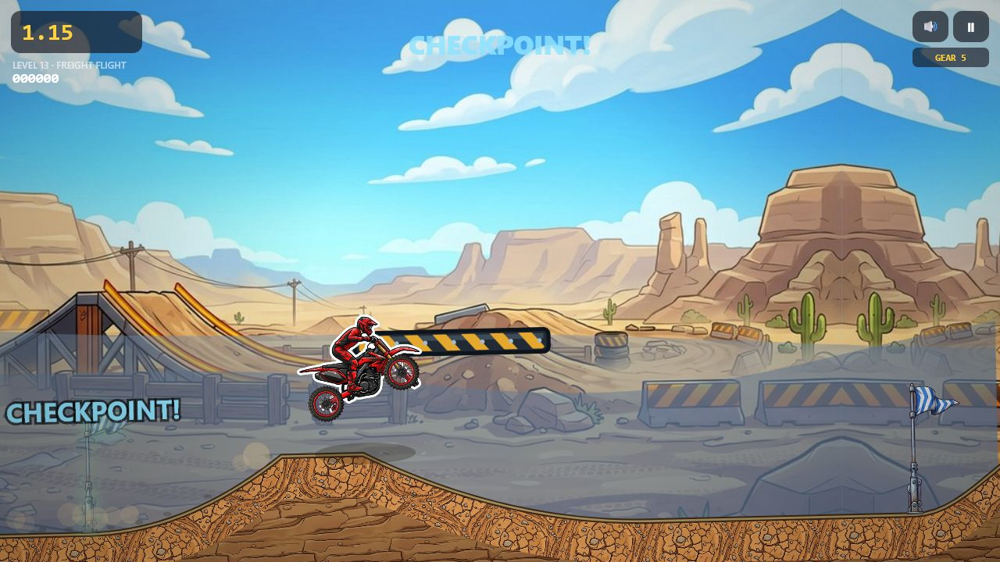
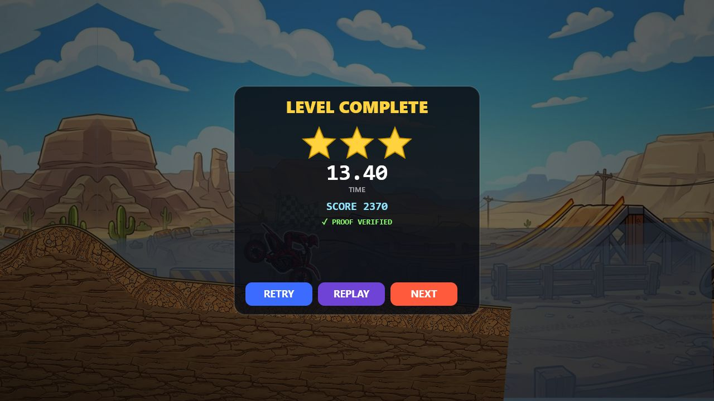
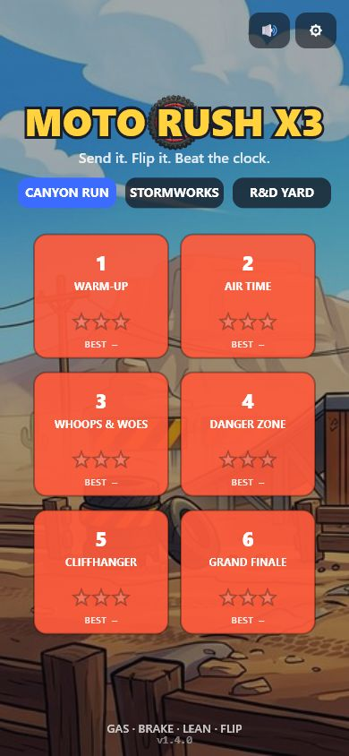

# Versioned Screenshot Archive

Every release-candidate gallery is kept in its own directory. These files are real browser captures of the repository runtime, not concept art.

## v1.5.0 — Gold Standard

| Gold-reference menu | Sensor-triggered lift |
|:---:|:---:|
|  |  |

| Aligned collision proxies | Verified Gold Run |
|:---:|:---:|
|  |  |

  

## v1.4.0 — Proof & Platforms

| R&D Yard menu | Freight platform route |
|:---:|:---:|
|  |  |

| Crash theater | Verified player replay |
|:---:|:---:|
|  |  |

  

